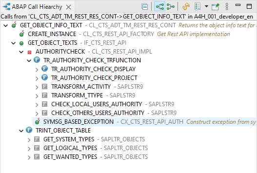

## Overview

ADT plug-in for analyzing the called members of a class method, a function module or a subroutine.

:::warning Important
The plug-in is still in a beta state and only available on the [Eclipse Development Update Site](https://eclipse.devepos.com/dev).
:::

## Source Code

The source code for the plug-in is MIT licensed and available on GitHub:

- [abap-call-hierarchy-ui (ADT)](https://github.com/DevEpos/eclipse-adt-plugins/tree/main/features/call-hierarchy)
- [abap-call-hierarchy (ABAP)](https://github.com/DevEpos/abap-call-hierarchy)
