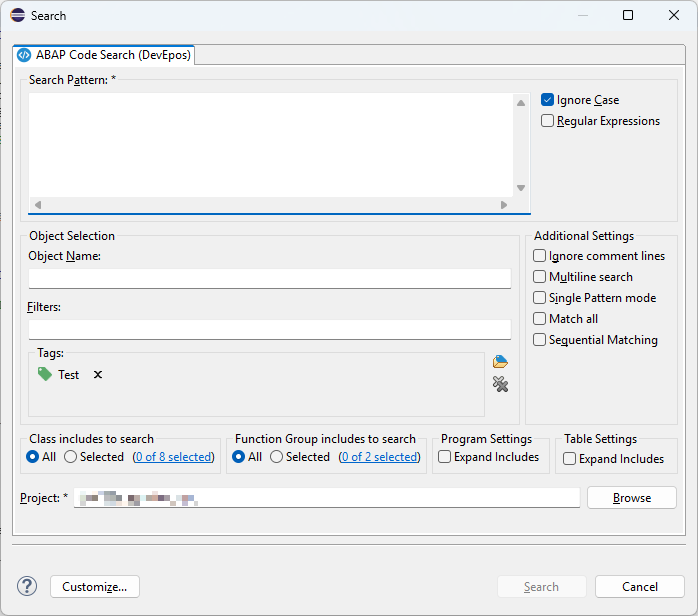

## Description

The ABAP Code Search enables one to search ABAP sources.

It comes in two flavors:

### Client-Based

In the client-based approach, the existing ADT REST API is used to search for relevant objects in the ABAP system. Once the source code is retrieved, the search is performed in the client. Due to the [used APIs](https://help.sap.com/docs/abap-cloud/abap-development-tools-user-guide/abap-repository-trees-concept?locale=en-US) the client-based search only works with a minimum ABAP version of 7.51 and a connected HANA database.

:::info
For this search mode only the [Eclipse Plugin](#frontend-eclipse) is required
:::

#### Supported Environments

- ABAP Platform 7.51+
- S/4HANA
- S/4HANA Private Cloud Edition
- S/4HANA Public Cloud Edition
- BTP ABAP Environment

### Server-Based

The ABAP Code Search plug-in communicates with the corresponding [ABAP backend](#backend-abap) to perform the search completely in the ABAP system. Only the match results are reported back to the client.

#### Supported Environments

- ABAP Platform 7.40+
- S/4HANA
- S/4HANA Private Cloud Edition

## Installation

### Frontend (Eclipse)

- Use Eclipse [Update Site](https://eclipse.devepos.com/latest) or
- Install via [Marketplace (drag-n-drop)](https://marketplace.eclipse.org/marketplace-client-intro?mpc_install=5507008)

### Backend (ABAP)

:::important
The installation is required for the [Server-Based](#server-based) search
:::

- Use abapGit to install [abap-code-search](https://github.com/DevEpos/abap-code-search-tools)

## Source Code

The source code for the plug-in is MIT licensed and available on GitHub:

- [abap-code-search-ui (ADT)](https://github.com/DevEpos/eclipse-adt-plugins/tree/main/features/code-search)
- [abap-code-search (ABAP)](https://github.com/DevEpos/abap-code-search-tools)

## Content

- [Features](features/)
- [Release Notes](release-notes/)
