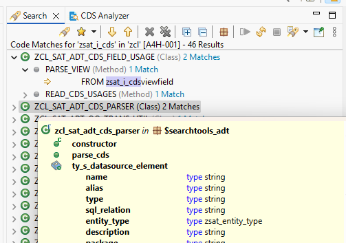

## 1.12.0 - 2025-05-03

### Features

- Enable _Show Element Information_ on search results via `F2` or context menu action (see [Element Information](https://help.sap.com/docs/abap-cloud/abap-development-tools-user-guide/displaying-code-element-information-in-source-code-editors?locale=en-US))

## 1.11.0 - 2024-05-30

### Features

- Search structures and database tables
  :::important Attention
  ADT Backend [abap-code-search-tools](https://github.com/DevEpos/abap-code-search-tools) needs to be updated to **v1.6.0** for this feature.
  
  To search structures you need ABAP Backend `7.50` and for database tables `7.52`.
  :::

## 1.10.0 - 2024-02-12

### Features

- Search by transport request/task  
  :::important Attention
  ADT Backend [abap-code-search-tools](https://github.com/DevEpos/abap-code-search-tools) needs to be updated to **v1.5.0** for this feature
  :::

## 1.9.0 - 2023-11-28

### Features

- New unified Search Favorites
  
- Text Filter possibility for Search Result View
  

## 1.8.0 - 2023-05-27

### Features

- Adds option to continue a search query that was cancelled or interrupted

### Changes

- Search Matches in object type Data Definition are now grouped under the contained Entity with its contained camel-case name.
  
- Behavior definitions are displayed with the name of the corresponding root CDS entity
  

## 1.6.0 - 2023-04-23

### Features

- Adds export function for code search results

## 1.5.0 - 2023-03-27

### Features

- Added new context menu actions to result nodes like _Run as..._, _Coverage as..._

## 1.4.0 - 2023-02-20

### Features

- New preference for controlling some Search Dialog options
- Adds new option Expand Includes for program types, that allows searching of includes of a program
- The Code Search can now be trigger via the context menu of the Search View. This is supported for the following search result pages:

  - Where-Used-List Result
  - ABAP Object Search Result
  - ABAP Object Search Result (DevEpos)
  - ABAP Tagged Object Search Result (DevEpos)

- The Code Search can now be triggered via the context menu of the CDS Analyzer View (ABAP Search and Analysis Tools Plug-in required)
- Enhance filter transfer if Code Search is called from context menu of Project Explorer
- The Code Search Dialog can now also be opened from the following folder types in the Project Explorer:
  - Type Folder (type)
  - Type Group Folder (group)
  - Date (created, month, date)
  - User (owner)
  - Application Component (appl)
  - Package (package)
  
  

  

## 1.3.0 - 2022-10-21

### Features

- Show the searched lines of code in the runtime information dialog

## 1.2.0 - 2022-10-19

### Features

- Show multiline matches in a custom tooltip in the Code Search result

## 1.1.0 - 2022-03-23

### Features

- Integration of ABAP Tags into Search Dialog  
  This allows you to restrict the search scope to objects with specific tags
- Open Code Search Dialog from context menu action on [Repository Trees](https://help.sap.com/docs/ABAP_PLATFORM_NEW/c238d694b825421f940829321ffa326a/c5660c7ea8ae4955bc565a6256ea061d.html)
  

  :::info
  Only the relevant filters for the Code Search will be transferred from the tree configuration to the search dialog.
  :::

## 1.0.0 - 2022-03-05

Initial release with following included features

New Search Tab ABAP Object search integrated into eclipse Search Dialog.  
The initial release supports the following source types

- Classes
- Interfaces
- Programs / Includes
- Function Groups
- Type Groups
- Data Definitions
- Access Controls
- Metadata Extensions
- Simple Transformations
- Behavior Definitions
