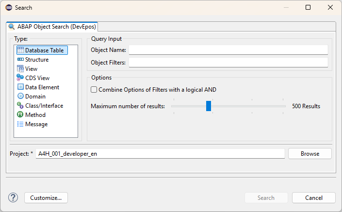

## Overview

ABAP Search and Analysis Tools is an Open Source plugin which provides tools for searching and analyzing repository objects.  

### Features

- Extended ABAP Object search integrated into eclipse Search Dialog  

  

  It currently supports the following object types:
  - Database Table
  - View
  - CDS View
  - Class / Interface
  - Method
  - Message

- View for analyzing CDS View  
  The following analyses are possible at the moment:
  - Top-Down Analysis for CDS Views
  - Used-Entities analysis of a CDS View
  - Where-Used in CDS View for a CDS View/Database table/Database
    view
  - Field Analysis for a CDS View/Database table/Database view

## Source Code

The source code for the plug-in is MIT licensed and available on GitHub:

- [abap-search-tools-ui (ADT)](https://github.com/DevEpos/eclipse-adt-plugins/tree/main/features/search-tools)
- [abap-search-tools (ABAP)](https://github.com/DevEpos/abap-search-tools)
