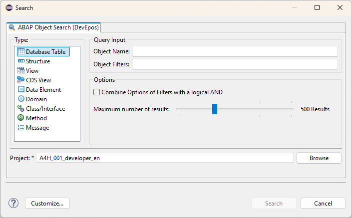
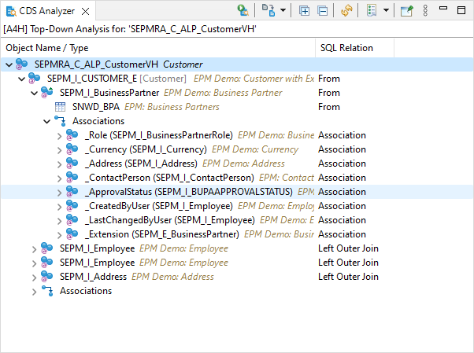

## Advanced Object Search

It currently supports the following object types:

- Database Table
- Structure
- View
- CDS View
- Data Element
- Domain
- Class / Interface
- Method
- Message

## View for analyzing CDS View  

The following analyses are possible at the moment:

- Top-Down Analysis for CDS Views
- Used-Entities analysis of a CDS View
- Where-Used in CDS View for a CDS View/Database table/Database view
- Field Analysis for a CDS View/Database table/Database view
