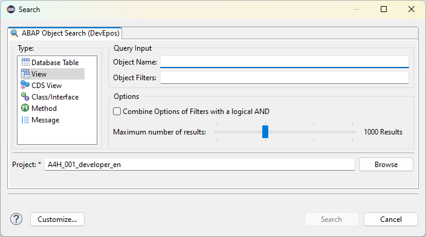
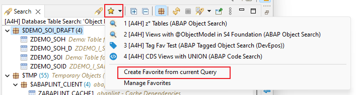
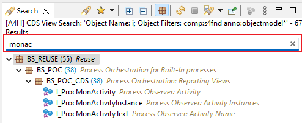
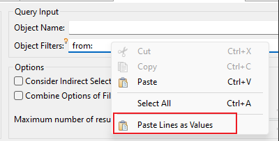
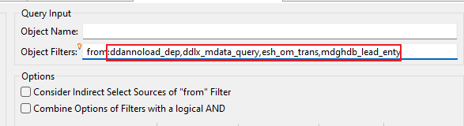
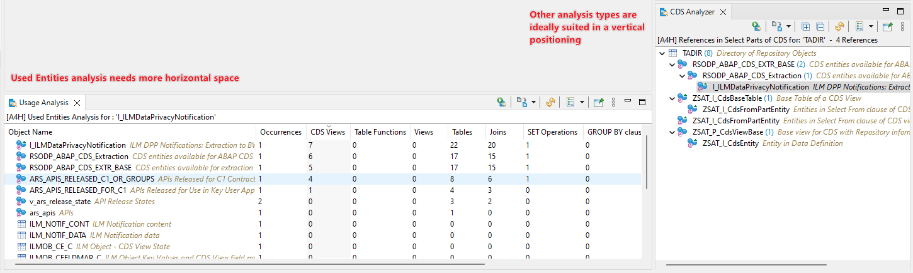
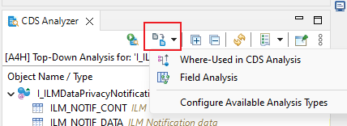
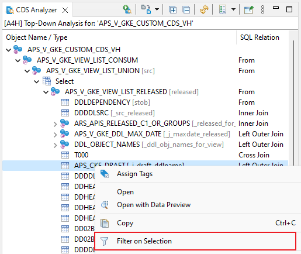
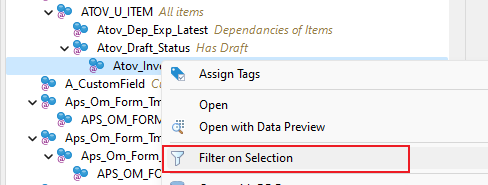
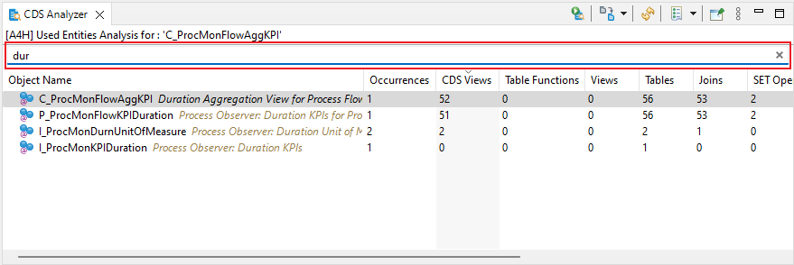

## 2.0.0 - 2023-11-28

:::warning ATTENTION
Due to breaking changes in this release, the abapGit repository [abap-search-tools](https://github.com/devepos/abap-search-tools) needs to be updated to version **2.0.0** in the targeting ABAP system.
:::

### ABAP Object Search

#### Features

- Redesign of search dialog

- New search type View
- New search type Method
- New search type Message
- New Filters in CDS View Search:
  - changedby - Last Changed By
  - changed - Last Changed Date
  - comp - Software component
  - appl - Application Component
  - basefield - Base Field Usage (i.e. matnr as Product -> matnr is the base field)
- New Filters in Database Table Search:
  - changedby - Last Changed By
  - changed - Last Changed Date
  - comp - Software component
  - appl - Application Component
  - enhcat - Enhancement Category
  - maintflag - Maintenance Flag
  - storetype - Storage Type
  - buffering - Buffering Status
  - buffertype - Buffering Type
  - dataclass - Data Class
  - sizecat - Size Category
  - include - Usage of Include Structure
- New Filters in Class/Interface Search:
  - changedby - Last Changed By
  - changed - Last Changed Date
  - comp - Software component
  - appl - Application Component
- New unified Search Favorites

  
- Text Filter possibility for Search Result View

  
- New option to paste clibpoard rows as values in name or filter fields

  

  

### CDS Analysis

#### General Updates

- New option to rename your CDS Analyzer View
- Restrict the available analysis types in your CDS Analyzer and create specific view instances in your workspace that handle specific analysis types only
  
  
- Easy analysis type switching for the current input

  
  
- Show overlay icon for deprecation API state of CDS Views

#### Top-Down Analysis

- New filter option to show only certain sub tree of the analysis

  
- Enable display of CDS View Entities that contain `Except` or `Intersect`

#### Where-Used Analysis

- New Recursive Loading option for Where-Used-in-CDS Analysis {.no-p}
- New Filter Option to show only certain sub tree of the analysis
- New Text Filter Option

  
  
#### Used Entities Analysis

- New metrics
- New Text Filter Option

  

## 1.10.0 - 2023-05-27

### ABAP Object Search

#### Features

- CDS entities of type Projection are now overlayed with a custom icon

  
- CDS entities of type Hierarchy are now overlayed with a custom icon

  

## 1.9.0 - 2023-03-27

### ABAP Object Search

#### Features

- Added new context menu actions to result nodes like Run as..., Coverage as...

## 1.7.0 - 2022-08-29

### CDS Analyzer

#### Features

- View settings can now be changed in eclipse preferences
- Settings state is stored together with each analysis result

## 1.6.0 - 2022-08-28

### CDS Analyzer

#### Features

- New command in view toolbar () to run a CDS analysis for a given object
- New command in main toolbar () to run a CDS analysis for a given object
- Added Pin to View action to toolbar
- Added option to open Analysis in new View from the history dialog
- Added option to open Analysis from history dropdown via `CTRL`+`LMouse`

## 1.5.0 - 2022-03-05

### Technical changes

- Minimum execution environment changed to JavaSE-11

### Updates for all plugins

#### Features

- The Preferences and Views are now grouped under the name *DevEpos*

## 1.4.0 - 2021-04-21

### Updates for all plugins

#### Features

- Added DevEpos branding in eclipse About dialog.

### ABAP Object Search

#### Features

- Add search parameter Delivery class () in search type Database Table/View

### CDS Analyzer

#### Features

- Enable *Show In* context (`ALT`+`SHIFT`+`W`)

## 1.2.0 - 2019-12-05

### ABAP Object Search

#### Features

- New preference to set the input control which get's the initial focus in the search dialog
- New preference to take the current text selection as Object name in the search dialog

#### Fixes

- Allow negation for parameters param and desc

## 1.1.0 - 2019-12-01

### ABAP Object Search

#### Features

- Added new search type Class/Interface

#### Fixes

- Adds missing search filter validation after project changed

### CDS Analyzer - Where-Used In Analysis

#### Features

- New Setting to control whether all association usages are shown or only those where the association is defined locally

### CDS Analyzer - Top-Down Analysis

#### Features

- Show custom tooltip with the name, description and alias of the current entity under the cursor

### CDS Analyzer - Field Analysis

#### Features

- Add view layout toggle (automatic, horizontal, vertial)

## 1.0.0 - 2019-11-26

Initial release with following included features

### ABAP Object Search +

Extended ABAP Object search integrated into eclipse Search Dialog.
It currently supports the following object types

- CDS View
- Database Table/View

### CDS Analyzer

View for analyzing CDS View.
The following analyses are possible at the moment

- Top-Down Analysis for CDS Views
- Used-Entities analysis of a CDS View
- Where-Used in CDS View for a CDS View/Database table/Database view
- Field Analysis for a CDS View/Database table/Database view
