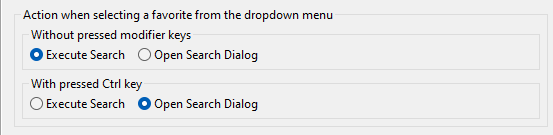

## 1.1.0 - 2024-02-12

### Features

- Favorites can now be renamed
- Project independent favorites are executed with the active project in the workspace
- New preference to control the action upon selecting a favorite from the dropdown menu  
  

## 1.0.0 - 2023-11-28

### Features

- Unified search favorite plug-in to allow management of arbitrary ABAP project search queries
- Integrated into:
  - ABAP Code Search
  - ABAP Object Search (DevEpos)
  - ABAP Tagged Object Search
- Import/Export features
- Control visibility of specific favorites in the dropdown menu positioned in the main toolbar