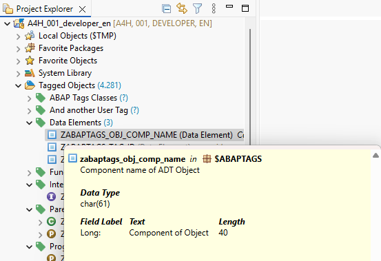
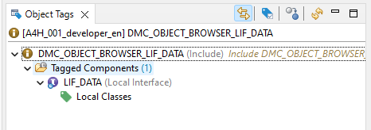
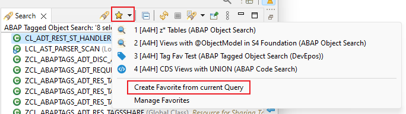
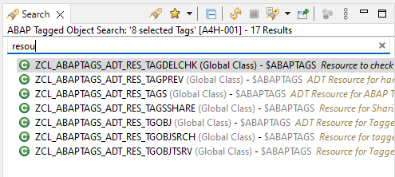
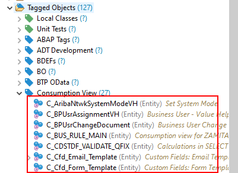
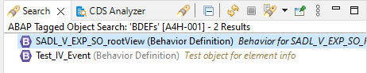

## 1.15.0 - 2025-07-04

### Features

- New wizard for [importing tags](./features.md#importing-abap-tags-wizard)
  
  :::warning ATTENTION
  Requires version **v2.7.0** of the ADT Backend [abap-tags-backend](https://github.com/DevEpos/abap-tags-backend)
  :::
- New wizard for [exporting tags](./features.md#exporting-abap-tags-wizard)
  
  :::warning ATTENTION
  Requires version **v2.7.0** of the ADT Backend [abap-tags-backend](https://github.com/DevEpos/abap-tags-backend)
  :::

### Changes

- Added keyboard shortcuts for _Expand all_ and _Collapse all_ to all ABAP Tag tree controls
- Added keyboard shortcuts for _New Global Tag_ and _New User Tag_ in [_Tagging Wizard_](./features.md#wizard-for-tagging-repository-objects)

## 1.14.0 - 2025-05-03

### Features

- Enable _Show Element Information_ on _ABAP Tagged Object Search_ result and _Tagged Object Trees_ via `F2` or context menu action (see [Element Information](https://help.sap.com/docs/abap-cloud/abap-development-tools-user-guide/displaying-code-element-information-in-source-code-editors?locale=en-US))

## 1.13.0 - 2025-02-20

### Tagged Object Trees

#### Features

- New context menu entry `Duplicate` for objects under tags

## 1.12.0 - 2024-08-11

### ABAP Tags

#### Features

- New option _Consider only deleted objects_ in* the _Remove Tags from Objects Wizard_, that restricts the results to tagged objects where the objects no longer exist in the repository.

  :::warning ATTENTION
  Requires version **v2.6.0** of the ADT Backend [abap-tags-backend](https://github.com/DevEpos/abap-tags-backend)
  :::

#### Changes

- _Object Tags_-view now also shows tagged components that no longer exist, to easily delete them

## 1.11.0 - 2023-11-28

### ABAP Tags

#### Features

- Local Classes/Interfaces of Programs, Program Includes, Function Group Includes and Functions can now be tagged as well
  

  :::warning ATTENTION
  For this feature you have to install at least Version **v2.4.0** of the ADT Backend [abap-tags-backend](https://github.com/DevEpos/abap-tags-backend)
  :::

- Object deletion is now possible from Tagged Object Trees (in Project Explorer View)

#### Fixes

- Tag removal from local components via Tagged Object Trees (in Project Explorer View)

### ABAP Tagged Object Search

#### Features

- New unified Search Favorites
  
- Text Filter possibility for Search Result View
  

## 1.10.0 - 2023-05-27

### General Changes

#### Changes

- For objects of type Data Definition the contained Entity names are displayed instead of the upper case DDL name
  
- For objects of type Behavior Definition the corresponding entity name of the root CDS Entity is shown instead.
  

## 1.9.0 - 2023-04-22

### ABAP Tagged Object Search

#### Features

- Adds the Select Sub Tree action to the context menu of the tree

### Tag Selection Dialog - Extension in ABAP Code Search

#### Features

- Adds the Select Sub Tree action to the context menu of the tree

### Tag Manager View

#### Fixes

- Fixed minor graphic issue when the filter control was shown/hidden

## 1.8.0 - 2023-04-16

### Wizard to remove Tags from Objects <Badge text="New" type="tip" />

This wizard gives you an easy way to remove Tags from Repository objects.

### ABAP Tagged Object Search

#### Features

- Added toolbar for tags viewer with actions Expand All, Collapse All, Deselect All
- New shortcut `Ctrl`+`F` to jump to filter field from tree

### Tag Manager View

#### Features

- Improved User experience on the tags tree
  - New shortcut `Ctrl`+`ENTER` to create new tags
  - New shortcut `ENTF` to delete a list of selected tags
  - Selection and expandsion levels of folders are kept after a tree refresh

### Tag Objects Wizard

#### Features

- New shortcut `Ctrl`+`F` to jump from the tree to filter field on the Tag Selection Page

#### Changes

- Viewer buttons on table/tree controls have been replaced with toolbar controls

## 1.7.0 - 2023-03-27

### Component Tagging <Badge text="New" type="tip" />

This is a brand new feature that gives you possibility to add Tags to a component of a Repository Object.

### ABAP Tagged Object Search

#### Features

- Added new context menu actions to result nodes like _Run as..._, _Coverage as..._

## 1.6.0 - 2023-03-17

### Tagged Object Tree <Badge text="New" type="tip" />

Dynamic Tree, similar to the ABAP Repository Trees that is located in the Project Explorer View.

#### Features

- Lists all tags that have assigned objects (direct or on lower tree levels)
- Upon expanding a node in the tree the assigned tags or objects are loaded on the fly
- Assigned Objects (e.g. Classes, Interfaces, etc.) have context menu entries like Run as, Open with... or Share Link

### Tag Manager View

#### Features

- New deletion dialog for tags → tags can only be deleted now if no more objects are assigned to it or tags on a lower tree level
- New context menu entry Remove assigned Objects that deletes all assigned objects of that node

### Tag Objects Wizard

#### Changes

- Hierarchical tags do no longer require a mandatory parent object
- A hierarchical tags can now be assigned multiple times with different parent objects
- A hierarchical Tag can be assigned with any tagged parent object in the same tree (ascending only)

### Object tags View

#### Features

- Parent objects are now visible as well if an object is tagged with a hierarchical Tag and a parent object was chosen

### ABAP Tagged Object Search

#### Changes

- Browsing of referenced child objects via Parent Tag assignments was removed → Tagged Object Tree should be used instead

## 1.3.0 - 2022-03-05

### Technical changes

- Minimum execution environment changed to JavaSE-11

### Updates for all plugins

#### Features

- The Preferences and Views are now grouped under the name DevEpos

## 1.2.0 - 2021-04-21

### Updates for all plugins

#### Features

- Added DevEpos branding in eclipse About dialog.

## 1.1.0 - 2021-04-19

### Tag Manager View

#### Features

- Renamed from Tags
- Create Shared Tags by assigning User Tags to one or several other users

### Tag Objects Wizard

#### Features

- Tag objects with Shared Tags

### Object Tags View

#### Features

- Renamed from Tag Explorer

### ABAP Tagged Object Search

#### Features

- Renamed from ABAP Tag Search

## 1.0.0 - 2020-07-12

### ABAP Tags

Plug-in which allows the tagging of repository objects and searching those tagged objects

#### Tags View

View to manage all tags in the currently selected project

#### Tag Objects Wizard

Wizard to tag one or several repository objects

#### Tag Explorer View

View to manage the tags of the currently selected ADT

#### ABAP Tag Search

Search page - integrated into the eclipse Search Dialog - which allows the searching for tagged objects
