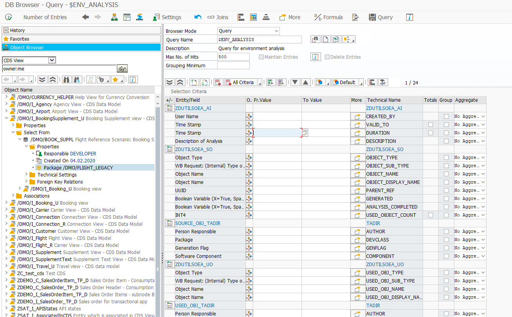

*ABAP DB Browser* is a SAP GUI Transaction which combines functionalities of well-known Transactions `SE16N` and `SE16H`.

## Source Code

The source code is MIT licensed and available on GitHub:

- [abap-db-browser](https://github.com/DevEpos/abap-db-browser)

## Content

- [Overview](features/)
- [Installation Instructions](installation/)
