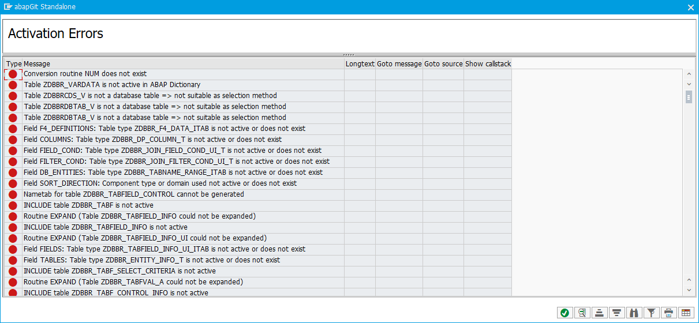
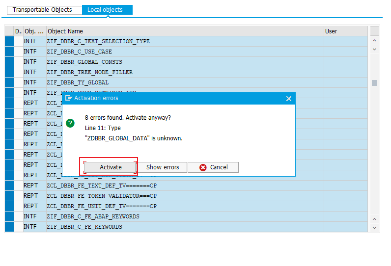
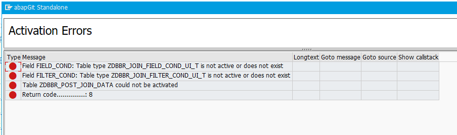
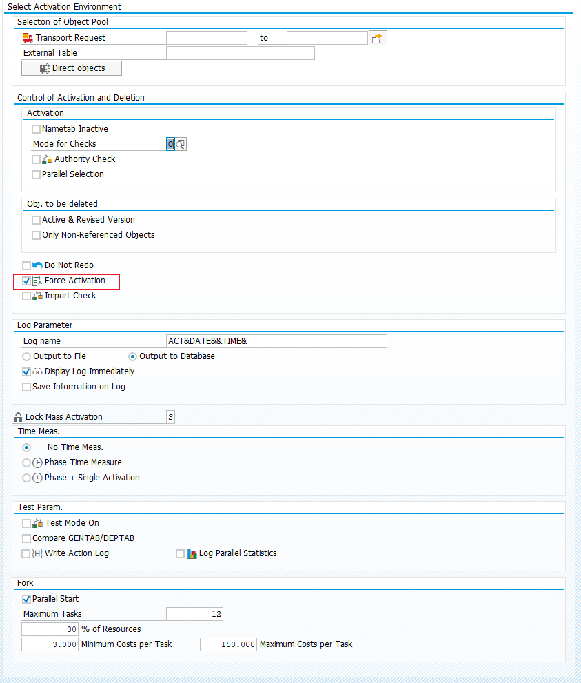
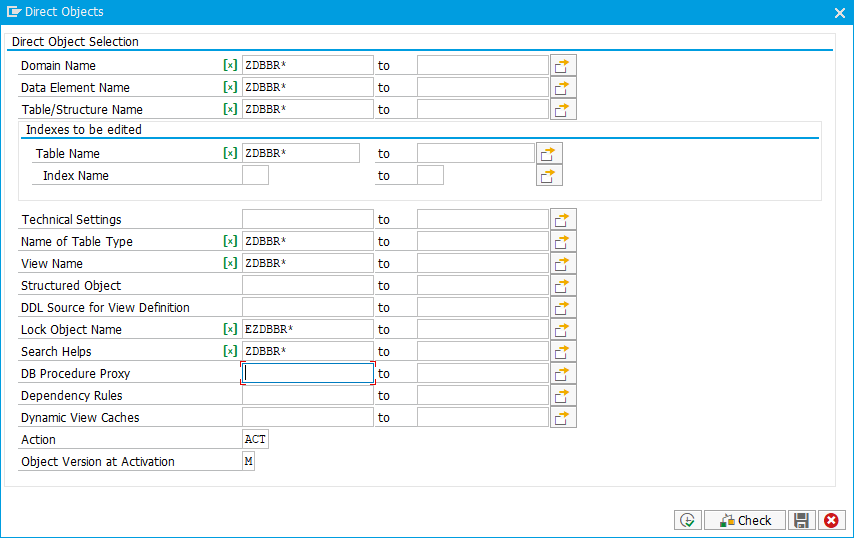

:::tip Note
All needed repositories - including this one - are to be installed via [abapGit](https://github.com/abapGit/abapGit#abapGit)
:::

## Install of dependencies

1) Install [abap-ui-toolbox](https://github.com/stockbal/abap-ui-toolbox)
2) Install [abap-search-tools](https://github.com/stockbal/abap-search-tools)  
   - Choose the appropriate branch according to your system (see [Correct NW Branch](https://github.com/stockbal/abap-search-tools#choosing-the-correct-branch-for-your-system))

## Install DB Browser

:::warning
The system must be at least NW v7.50
:::

1) Install [abap-db-browser](https://github.com/stockbal/abap-db-browser)  
2) Ignore DDIC activation errors
   1) Due to some dependencies to objects - which are created in a later install step - there are several DDIC objects which cannot be activated  
   
   2) Continue with `ENTER`
3) Activate objects when the dialog appears  
   1) Activate them regardless of errors  
      
   1) Result from *Activate Objects*  
      
4) As some DDIC object are now still in status *New* or *Inactive* they have to be activated manually. This can be done with the Report `RADMASG0_C3`  
   1) The following Flags should be changed  
      - [ ] Authority Check
      - [X] Force Activation  
      
   2) Choose objects to be activated via *Direct Objects* button on the screen  
      
   3) Execute the activation via `F8`
5) Check if there are still objects to be deserialized via transaction `ZABAPGIT` (or Program `ZABAPGIT_STANDALONE`) depending on your abapGit installation. If it's the case that there are still some objects that are only remotely accessible, perform another pull.
6) The transaction `ZDBBR` aka *DB Browser* should now start without any errors
